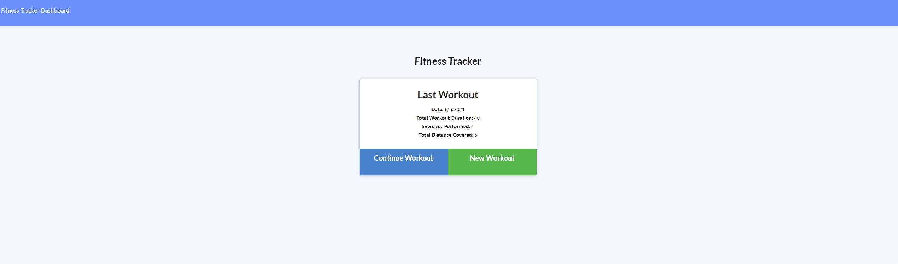
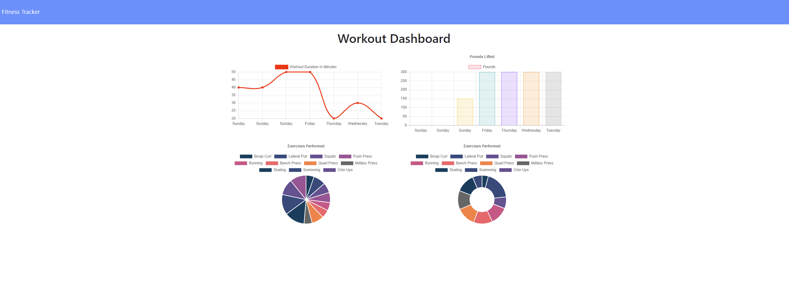
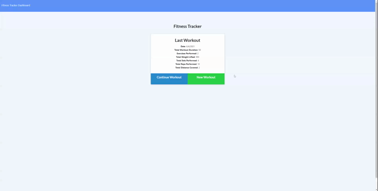

# Fitness Tracker 

## Table of Contents

- [Description](#description)
- [Technology Used](#technology)
- [Resources](#resources)
- [Licensing Information](#licensing)
- [Screenshots](#screenshots)
- [GIF Demonstration](#demonstrations)
   
   

## Description

This is a project using Node.js, Express.js, MongoDB, and Mongoose ODM to build a fitness tracker website. When the user first visits the fitness tracker, they will see a page that displays their last workout, if there is one, and options to continue last workout or create a new one. If the user selects new workout, they will be taken to a page to select a cardio or resistance workout. If they choose cardio, they will have the fields to enter the name of exercise, distance, and duration. If they choose resistance, they will have fields to enter name, weight lifted, sets, reps, and duration. Once the user enters each of these they can choose to complete workout, or add another exercise. If they choose complete, they will return to the main page and the workout they just entered will be displayed. If they chose add exercise, they can enter another cardio or resistance workout.

On the main page, if the user chooses to continue workout, they will be taken to the add exercise page, but when they enter in this exercise, it will be added to the last exercise. Finally, when the user clicks on Dashboard, they are taken to a page with four charts. The first chart is a line graph that displays the last seven workouts entered and their duration. The bar graph displays the last seven workouts and their total combined weight lifted. The pie chart shows the time spent on all workouts and the donut chart displays total weight lifted for all workouts.

### Please follow [this link](https://aqueous-forest-70014.herokuapp.com/) to view the live application.

 

## Technology

- JavaScript
- Node.js
- Express.js
- MongoDB
- Mongoose ODM
- Morgan.js
- Chart.js

 
 

## Resources

- [Mongoose Documentation](https://mongoosejs.com/docs/guide.html)
- [MongoDB Documentation](https://docs.mongodb.com/manual/)
- [Chart.js Documentation](https://www.chartjs.org/docs/latest/)
   
   

## Licensing Information

This project is covered under the MIT license.

## Screenshots

## Demonstrations

 
